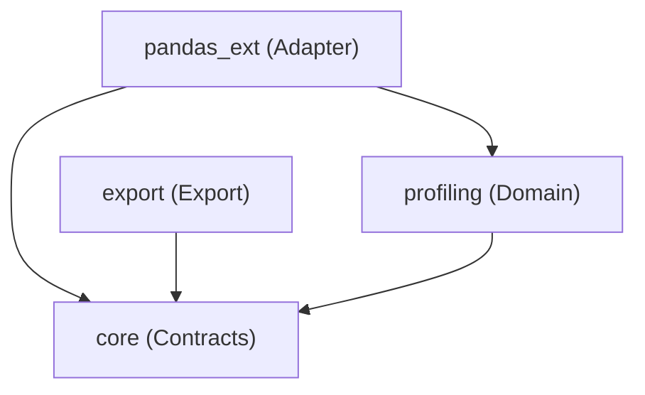

# **軟體設計文件 (Software Design Document - SDD)**

**專案名稱：** ds-data-miner（探索式資料分析計算核心引擎）
**文件版本：** v3.0
**設計原則：** 領域驅動設計 (DDD)、六角架構 (Hexagonal Architecture)、SOLID 原則

## **1. 系統架構設計 (System Architecture Design)**

### **1.1 架構總覽**

系統採用六角架構（Ports and Adapters）。核心領域層（Domain）封裝純數學運算與統計邏輯，完全與外部基礎設施隔離。所有的外部資料來源（如 Pandas DataFrame）皆必須透過介面轉接層（Adapters）進行轉換。分析結果統一由匯出層（Export）序列化為標準化 JSON 格式。

### **1.2 依賴流向 (Dependency Flow)**

**依賴反轉原則 (DIP) 實踐：**

* `pandas_ext` (Adapter) ➡️ 依賴 ➡️ `core` & `profiling`
* `export` (Export) ➡️ 依賴 ➡️ `core`
* `profiling` (Domain) ➡️ 依賴 ➡️ `core`
* `core` ➡️ 無內部模組依賴（僅依賴 `pydantic`）



## **2. 核心資料合約設計 (Core Data Contracts Design)**

位於 `src/ds_data_miner/core/contracts.py`。
作為跨模組通訊的唯一標準，必須設計為**不可變物件 (Immutable Objects)**，使用 **Pydantic v2 `BaseModel`** 搭配 `frozen=True` 配置，以避免運算過程中的副作用 (Side Effects)，同時獲得內建的 JSON 序列化與型別強制轉換能力。

### **2.1 自定義 JSON 序列化器**

所有合約共用的序列化配置，處理 NumPy 型別與特殊浮點數轉換：

```python
import math
from typing import Any

from pydantic import BaseModel, ConfigDict


def sanitize_float(v: Any) -> float | None:
    """
    將 NaN / Inf / -Inf 轉換為 None (JSON null)。
    將 NumPy 純量轉為 Python float。
    """
    if isinstance(v, (int, float)):
        if math.isnan(v) or math.isinf(v):
            return None
        return float(v)
    # Handle numpy scalar types
    try:
        import numpy as np
        if isinstance(v, np.integer):
            return int(v)
        if isinstance(v, np.floating):
            f = float(v)
            if math.isnan(f) or math.isinf(f):
                return None
            return f
    except ImportError:
        pass
    return v


class ProfileBaseModel(BaseModel):
    """所有 Profile 合約的基礎類別。"""

    model_config = ConfigDict(
        frozen=True,
        ser_json_inf_nan="null",
    )
```

### **2.2 DistributionProfile 類別**

儲存數值型資料全量掃描後的統計結果，包含統計誤差與直方圖預計算。

```python
class DistributionProfile(ProfileBaseModel):
    """描述數值型資料統計特徵的合約。"""

    # 基礎統計量
    mean: float
    variance: float
    std: float
    skewness: float
    kurtosis: float
    median: float
    min: float
    max: float
    q25: float
    q75: float

    # 統計誤差 (Statistical Errors)
    sem: float                     # Standard Error of Mean = σ / √N
    ci_lower: float                # 信賴區間下界 (預設 95%, z=1.96)
    ci_upper: float                # 信賴區間上界

    # 直方圖表示（供下游 ds-data-miner-vis 使用）
    histogram_bin_edges: list[float]
    histogram_counts: list[int]

    # 樣本與品質資訊
    n_samples: int                 # 總筆數（含 missing）
    n_valid: int                   # 有效筆數（排除 NaN/Inf）
    missing_count: int
    missing_ratio: float           # missing_count / n_samples
    inf_count: int

    # 分佈檢定結果（可選，由 DistributionTester 填入）
    distribution_type: str | None = None
    ks_statistic: float | None = None
    ks_p_value: float | None = None
```

### **2.3 CategoricalProfile 類別**

儲存類別型資料全量掃描後的統計結果，含高基數防禦標記。

```python
class CategoryStats(ProfileBaseModel):
    """單一類別的統計數據。"""

    category: str
    count: int
    proportion: float
    std_error: float  # 二項式分佈標準誤: sqrt(p*(1-p)/N)


class CategoricalProfile(ProfileBaseModel):
    """描述類別型資料統計特徵的合約。"""

    stats: list[CategoryStats]
    n_total: int
    n_unique: int
    missing_count: int
    missing_ratio: float

    # 高基數防禦
    is_high_cardinality: bool      # 是否超過截斷閾值
    truncated_at: int | None = None  # 實際截斷點 (Top-N)
```

### **2.4 DatetimeProfile 類別**

儲存時序型資料的特徵分析結果。

```python
class DatetimeProfile(ProfileBaseModel):
    """描述時序型資料特徵的合約。"""

    start: str                     # ISO 8601 格式
    end: str                       # ISO 8601 格式
    duration_seconds: float        # 總持續時間
    is_monotonic_increasing: bool  # 是否單調遞增
    gap_count: int                 # 時間斷層數量
    gap_locations: list[dict]      # [{"from": ..., "to": ..., "duration_seconds": ...}]
    inferred_freq: str | None      # 推估的採樣頻率 (如 "1min", "1h")

    n_samples: int
    missing_count: int             # NaT 數量
    missing_ratio: float
```

### **2.5 DatasetReport 類別**

頂層聚合容器，封裝整個資料集的分析結果。

```python
class DatasetReport(ProfileBaseModel):
    """頂層資料集報告合約。"""

    dataset_name: str
    created_at: str                # ISO 8601
    ds_data_miner_version: str
    total_rows: int
    total_columns: int

    # 全域品質指標
    duplicate_row_count: int
    duplicate_row_ratio: float

    # 各欄位 Profile
    columns: dict[str, DistributionProfile | CategoricalProfile | DatetimeProfile]
```

## **3. 領域層模組設計 (Domain Layer Design)**

### **3.1 統計特徵萃取模組 (ds\_data\_miner.profiling)**

**設計模式：** 策略模式 (Strategy Pattern)。
定義統一的介面，允許未來抽換或擴充不同的特徵萃取演算法。

#### **3.1.1 BaseProfiler (ABC)**

```python
from abc import ABC, abstractmethod

import numpy as np
from pydantic import BaseModel


class BaseProfiler(ABC):
    @abstractmethod
    def fit(self, data: np.ndarray) -> BaseModel:
        """
        [架構規範]：
        - 強制在本地 Runtime 中完整掃描 data。
        - 禁止任何形式的內部降取樣 (Down-sampling)。
        - 必須使用向量化操作，嚴禁 Python 原生 for 迴圈。
        """
        pass
```

#### **3.1.2 NumericProfiler**

```python
class NumericProfiler(BaseProfiler):
    def __init__(
        self,
        ignore_nan: bool = True,
        ci_level: float = 0.95,
        n_bins: int | str = "auto",
    ) -> None:
        self.ignore_nan = ignore_nan
        self.ci_level = ci_level
        self.n_bins = n_bins

    def fit(self, data: np.ndarray) -> DistributionProfile:
        # 實作要點：
        # 1. 計算 missing_count = np.count_nonzero(np.isnan(data))
        # 2. 計算 inf_count = np.count_nonzero(np.isinf(data))
        # 3. 依據 ignore_nan 決定使用 np.nanmean / np.mean 系列函數
        # 4. 基礎統計量：np.nanmean, np.nanvar, np.nanstd, np.nanmedian,
        #    np.nanpercentile(data, [25, 75])
        # 5. 偏度/峰度：scipy.stats.skew, scipy.stats.kurtosis
        # 6. SEM = std / sqrt(n_valid)
        # 7. CI = mean ± z * SEM (z=1.96 for 95%)
        # 8. 直方圖：np.histogram(valid_data, bins=self.n_bins)
        #    → 存 bin_edges.tolist() 與 counts.tolist()
        # 9. 封裝為 DistributionProfile 回傳
        pass
```

#### **3.1.3 CategoricalProfiler（含高基數防禦）**

```python
import warnings


class HighCardinalityWarning(UserWarning):
    """類別型欄位的唯一值數量超過閾值時發出的警告。"""
    pass


class CategoricalProfiler(BaseProfiler):
    def __init__(
        self,
        max_cardinality: int = 100,
    ) -> None:
        self.max_cardinality = max_cardinality

    def fit(self, data: np.ndarray) -> CategoricalProfile:
        # 實作要點：
        # 1. 計算 missing：np.count_nonzero(pd.isna(data)) 或自行處理 None
        # 2. unique, counts = np.unique(valid_data, return_counts=True)
        # 3. 高基數偵測：if len(unique) > self.max_cardinality:
        #    a. 發出 HighCardinalityWarning
        #    b. 取 Top-N (依 count 排序)
        #    c. 將剩餘歸入 "_OTHER_" 桶
        # 4. 計算各類別 proportion = count / n_total
        # 5. 計算二項式標準誤 = sqrt(p * (1-p) / n_total)
        # 6. 封裝為 CategoricalProfile 回傳
        pass
```

#### **3.1.4 DatetimeProfiler**

```python
class DatetimeProfiler(BaseProfiler):
    def __init__(
        self,
        gap_threshold_factor: float = 2.0,
    ) -> None:
        self.gap_threshold_factor = gap_threshold_factor

    def fit(self, data: np.ndarray) -> DatetimeProfile:
        # 實作要點 (data dtype = datetime64)：
        # 1. missing_count = np.count_nonzero(np.isnat(data))
        # 2. valid = data[~np.isnat(data)]
        # 3. sorted_valid = np.sort(valid)
        # 4. is_monotonic = np.all(np.diff(data[~np.isnat(data)]) >= 0)
        # 5. diffs = np.diff(sorted_valid)
        # 6. median_diff = np.median(diffs)
        # 7. gap_mask = diffs > median_diff * self.gap_threshold_factor
        # 8. gap_locations = [{"from": ..., "to": ..., "duration_seconds": ...}]
        # 9. inferred_freq = pd.infer_freq(valid) 或手動推估 median_diff
        # 10. 封裝為 DatetimeProfile 回傳
        pass
```

#### **3.1.5 DistributionTester（獨立工具類別）**

不繼承 `BaseProfiler`，作為輔助的統計檢定工具。

```python
class DistributionTester:
    def __init__(self, dist_name: str = "norm") -> None:
        self.dist_name = dist_name

    def test(self, data: np.ndarray) -> dict[str, float]:
        # 實作 K-S Test 等，回傳 {"statistic": ..., "p_value": ...}
        # 使用 scipy.stats.kstest(data, self.dist_name)
        pass
```

#### **3.1.6 ProfilingEngine（全表掃描排程器）**

```python
class ProfilingEngine:
    """
    全表掃描排程器。
    接收完整的資料集（以 dict[str, np.ndarray] 表示），
    根據各欄位的 dtype 自動路由至對應的 Profiler，
    聚合結果為 DatasetReport。
    """

    def __init__(
        self,
        numeric_profiler: NumericProfiler | None = None,
        categorical_profiler: CategoricalProfiler | None = None,
        datetime_profiler: DatetimeProfiler | None = None,
    ) -> None:
        self.numeric_profiler = numeric_profiler or NumericProfiler()
        self.categorical_profiler = categorical_profiler or CategoricalProfiler()
        self.datetime_profiler = datetime_profiler or DatetimeProfiler()

    def profile_dataset(
        self,
        columns: dict[str, np.ndarray],
        dataset_name: str = "unnamed",
    ) -> DatasetReport:
        # 實作要點：
        # 1. 迭代 columns，根據 dtype 派發至對應 Profiler
        # 2. 聚合所有 Profile 至 columns dict
        # 3. 計算全域品質指標（重複列需在上層 Adapter 處理）
        # 4. 封裝為 DatasetReport 回傳
        pass
```

## **4. 介面轉接層與匯出層設計 (Adapter & Export Layer Design)**

### **4.1 Pandas 擴充模組 (ds\_data\_miner.pandas\_ext)**

**設計模式：** 轉接器模式 (Adapter Pattern)。
利用 Pandas 原生的 Extension API，將 DataFrame 無縫接入核心領域層，同時防堵 Pandas 物件滲透進 Core 內部。

```python
import pandas as pd
from ds_data_miner.core.contracts import DatasetReport
from ds_data_miner.profiling.engine import ProfilingEngine
from ds_data_miner.export.serializer import ReportExporter


@pd.api.extensions.register_dataframe_accessor("miner")
class MinerAccessor:
    def __init__(self, pandas_obj: pd.DataFrame) -> None:
        self._obj = pandas_obj

    def profile(self) -> DatasetReport:
        """
        Adapter 職責：
        1. 迭代 DataFrame 所有欄位。
        2. 依據 dtype 將 pd.Series 轉換為 np.ndarray
           (numeric → float64, object → object, datetime → datetime64)。
        3. 計算全域品質指標：重複列數量/比例。
        4. 呼叫 ProfilingEngine 進行全表掃描。
        5. 回傳 DatasetReport。
        """
        pass

    def export_json(self, path: str, indent: int = 2) -> None:
        """
        一站式 API：掃描全表 + 匯出 JSON。
        """
        report = self.profile()
        exporter = ReportExporter()
        exporter.export(report, path, indent=indent)
```

### **4.2 JSON 匯出模組 (ds\_data\_miner.export)**

**設計模式：** 序列化器模式。
負責將 Pydantic 合約序列化為格式化 JSON，並處理所有邊緣情況。

```python
import json
from pathlib import Path

from ds_data_miner.core.contracts import DatasetReport


class ReportExporter:
    """將 DatasetReport 序列化為標準化 JSON 檔案。"""

    def export(
        self,
        report: DatasetReport,
        path: str | Path,
        indent: int = 2,
    ) -> None:
        """
        序列化要點：
        1. 呼叫 report.model_dump(mode="json")
        2. 內部已由 Pydantic ser_json_inf_nan="null" 處理 NaN/Inf
        3. 寫入 JSON 檔案，使用指定縮排
        """
        path = Path(path)
        json_str = report.model_dump_json(indent=indent)
        path.write_text(json_str, encoding="utf-8")

    @staticmethod
    def export_schema(path: str | Path) -> None:
        """
        匯出 DatasetReport 的 JSON Schema 定義。
        供下游消費者 (ds-data-miner-vis, ds-data-miner-reporter) 驗證。
        """
        path = Path(path)
        schema = DatasetReport.model_json_schema()
        path.write_text(
            json.dumps(schema, indent=2, ensure_ascii=False),
            encoding="utf-8",
        )
```

## **5. 例外處理與防呆機制 (Exception Handling & Safeguards)**

為確保在半導體或製造業等嚴苛場景下資料運算的可靠性，定義以下專用 Exception 層次結構（位於 `ds_data_miner.core.exceptions`）：

```python
class DataMinerBaseException(Exception):
    """所有自定義例外之基礎類別。"""
    pass


class DataQualityError(DataMinerBaseException):
    """Profiler 掃描時遇到全部為 NaN 或不可挽回的髒資料。"""
    pass


class ShapeMismatchError(DataMinerBaseException):
    """資料維度不匹配時拋出。"""
    pass


class HighCardinalityWarning(UserWarning):
    """類別型欄位的唯一值數量超過截斷閾值時發出。"""
    pass
```

**防禦性程式設計：**

在 Profiler 內部，必須在計算前進行資料品質檢查：

```python
import numpy as np
from ds_data_miner.core.exceptions import DataQualityError


def _validate_numeric_input(data: np.ndarray, ignore_nan: bool) -> np.ndarray:
    """
    防禦性前處理：
    1. 驗證 dtype 為數值型。
    2. 偵測 NaN / Inf。
    3. 依據策略決定是否過濾或拋出例外。
    """
    if not np.issubdtype(data.dtype, np.number):
        raise TypeError(f"Expected numeric array, got dtype={data.dtype}")

    nan_count = int(np.count_nonzero(np.isnan(data)))
    inf_count = int(np.count_nonzero(np.isinf(data)))

    if nan_count == len(data):
        raise DataQualityError("Array is entirely NaN — cannot compute statistics.")

    if not ignore_nan and nan_count > 0:
        raise DataQualityError(
            f"Array contains {nan_count} NaN values. "
            "Set ignore_nan=True to skip them."
        )

    # 過濾 Inf 值
    valid_data = data[np.isfinite(data)] if ignore_nan else data
    if len(valid_data) == 0:
        raise DataQualityError("No valid data points after filtering NaN/Inf.")

    return valid_data
```

## **6. 開發與部署規範 (Deployment & Tooling)**

### **6.1 套件配置 (pyproject.toml 範例)**

採用 PEP 621 標準。核心依賴輕量化，Pandas 為可選依賴。

```toml
[project]
name = "ds-data-miner"
version = "0.1.0"
description = "EDA profiling engine: full-scan statistical analysis with standardized JSON output."
requires-python = ">=3.10"
dependencies = [
    "numpy>=1.21.0",
    "scipy>=1.7.0",
    "pydantic>=2.0.0",
]

[project.optional-dependencies]
pandas = [
    "pandas>=1.3.0",
]
dev = [
    "pytest>=7.0.0",
    "mypy>=1.0",
    "hypothesis>=6.0",
    "ruff>=0.1.0",
]

[tool.mypy]
strict = true
ignore_missing_imports = true
```

### **6.2 記憶體效能要求**

* 在 `NumericProfiler` 中，針對 1,000,000 筆 64-bit Float 資料（約 8MB）的 `fit()` 動作，必須在本地 Runtime 利用向量化直接計算。嚴禁將資料在類別內部進行 `list()` 轉換或 `deepcopy`，防止記憶體峰值 (Memory Spike) 導致 Container OOM。
* 在 `CategoricalProfiler` 中，遭遇高基數欄位（unique > 閾值）時，必須在 `np.unique` 後立即截斷至 Top-N，避免後續統計運算在超大 unique 陣列上進行。
* 直方圖計算使用 `np.histogram`（單次向量化呼叫），結果僅保存 `bin_edges` 與 `counts` 兩個 list，**不得**將原始陣列存入合約物件。